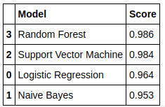

# Lyrics-Classification
In this project I built a web-scraper to scrape music lyrics, preprocessed the obtained text, then trained a model that predicts the artist from some lyrics entered by a user.  
For testing, I scraped around all the song lyrics of Eagles and Scorpions from www.lyrics.com and used the texts to train 4 different classifiers : ***Logistic Regression, Multinomial Naive Bayes, Support Vector Machine and Random Forest***.   Based on the accuracy scores , I selected Random Forest Classifier to be used to predict artist based on lyrics.